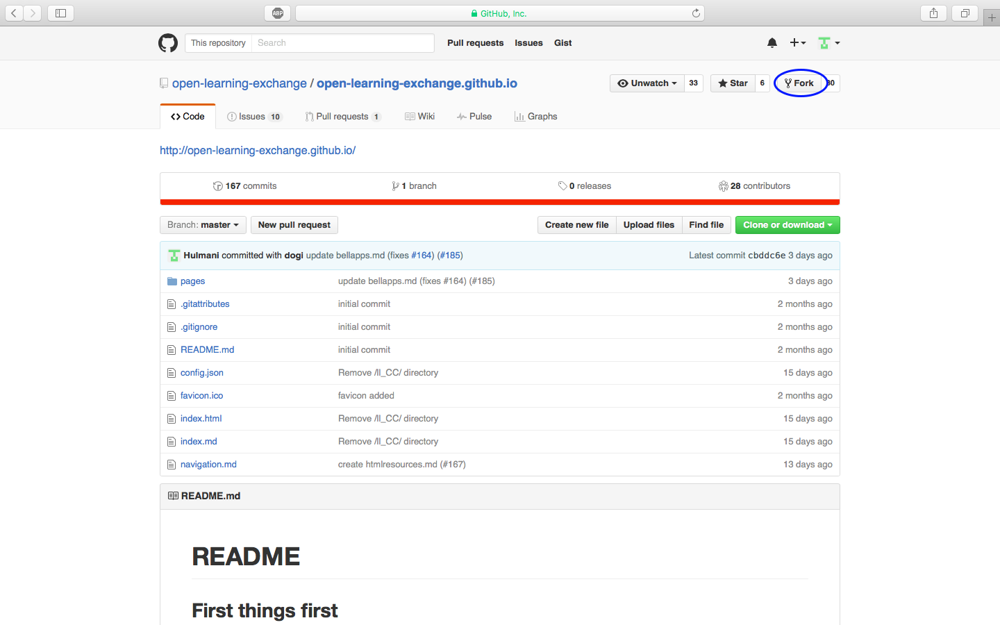

# GitHub and Markdown 
###Objective:
* Learn Github and Markdown wiki.
* Writing your own individual Markdown WIKI pages.
* Understanding of Fork,Repositories,Commits,Pull requests and working on Github.

###Prerequisites :
Already created Username on Github or Set up Github account.

[GitHub](https://help.github.com/categories/writing-on-github/) acts as a source code management system for Open Learning Exchange. It's a very simple open source system that is easy to learn and to use. Please read some of the basic instructions below as a user manual for OLE on GitHub. 

[Markdown Wiki](http://dynalon.github.io/mdwiki/#!quickstart.md) is the software you're currently reading on that OLE uses for our Virtual intern program. Markdown (MD) Wiki allows us to use Markdown and Javascript on GitHub so that it is easily compatible with our current development environment. To be explicit, Markdown is a simplified development language which allows you to format and write text. 
Below is a screenshot of what Markdown language with a preview looks like: 

Below is a cheat sheet of Markdown so you can have more information on writing MD on your individual Markdown Wiki pages:

The main GitHub page devoted to this is found at [open-learning-exchange/open-learning-exchange.github.io](https://github.com/open-learning-exchange/open-learning-exchange.github.io) and our virtual interns will essentially create their own Markdown Wiki page as a copy of open-learning-exchange.github.io. 
Please find the steps below to do this after a brief description of GitHub and its functionality. 

###Start here
Summary of steps are as follows please read further instructions for more details:  

* Login to Github with Username and Password  
* Find and Fork correct repository  
* Go to setting and Rename your repository  
* Post a link of your repository in chat  
* Create new file as your personal MD WIKI Page and Commiting changes  
* Pull Request  

Introduction and brief description of each steps are as follows:
####Login to Github with Username and Password
As you have already created a username on GitHub, we can assume that you understand the basic layout and functionality. Please explore and do some basic googling if not. On GitHub, it's important to always be sure that you are working on your own GitHub page if you're editing (which you can tell based off of the name before the slash and the repository after the slash: ex. EmilyLarkin/BeLL-Apps). All of Open Learning Exchange's work can be [found here](https://github.com/open-learning-exchange). All of the different repositories represent different types of software used by OLE and the repositories act as categorizing system. 

There is a lot of GitHub to learn, but to acclimatize you to it, we will provide a basic example of how to change something on GitHub. This example with specifically create your own &lt;username&gt;.github.io and allow you to edit and commit your changes. 

####Find and Fork correct repository
First, you will need to find the correct GitHub repository to fork. Forking is essentially creating a copy on your own user so that you don't edit or mess up the main file. To make it easier on you, I will provide you with a link to the correct repository [here](https://github.com/open-learning-exchange/open-learning-exchange.github.io). 
Now, you will fork the repository to your own page. Look at the picture below to find the fork button. 

####Go to setting and Rename your repository
After your fork it, you will be on your page: &lt;username&gt;/open-learning-exchange.github.io. Then go to settings at the top middle of the page and rename your repository to your GitHub username. See example below. 

####Post a link of your repository in chat
After you rename it, make sure to post a link to the github.io website you've just created (&lt;username&gt;.github.io) in the [gitter.im chat](https://gitter.im/open-learning-exchange/chat).

<em>
Important Note: Always pay attenstion while working to your personal and Open Learning Exchange git hub account.
</em>
Once again, it's important to distinguish now the difference between your personal GitHub account and the Open Learning Exchange account. As we want to keep a 'clean' version of code, everyone forks repositories and then saves them back for approval (called a pull request) before the Open Learning Exchange code is updated. Be sure to ALWAYS work on your personal account via forking and pull requests. 

####Create new file as your personal MD WIKI Page and Commiting changes
Now, you can edit the files in your repo and the changes you make will be reflected on your &lt;username&gt;.github.io website. To edit, click on `pages` folder. Then, click `New File` and make the filename the exact same name as your GitHub username. I have created pages for you using your GitHub username so it's important you stick with that name. For reference, my link to this page is EmilyLarkin.github.io/pages/EmilyLarkin.md and yours should look similar in a parallel format. 

From this, click the pencil icon to edit (as shown below) and type your name, your location/time zone, and OS (including version). Feel free to add a short description of yourself as well so your fellow virtual interns know who you are. Then scroll down to the bottom of the page, select the `Commit directly to the master branch` radio box and click `Commit New File`. 

Now check what this looks like on your own page (&lt;username&lt;.github.io/pages/&lt;username&lt;.md) and post a link to it on the [gitter.im chat](https://gitter.im/open-learning-exchange/chat). Check and double check that everything looks good and is working before initiating a pull request. 

####Pull Request
Then, you can create a pull request by clicking the `Pull requests` button and then clicking `New pull request`. Then click `Create pull request` and someone from our team will then merge and allow your pull request once everything looks good. After the pull request is completed, you'll be able to see this on open-learning-exchange.github.io in addition to your personal page. Let us know when you have completed this step in the [gitter.im chat](https://gitter.im/open-learning-exchange/chat).

###Useful links
[Github](https://help.github.com/categories/writing-on-github/)  
[Markdown](http://dynalon.github.io/mdwiki/#!quickstart.md)  
[Mastring Markdown](https://guides.github.com/features/mastering-markdown/)  
[Git-Help-Fork](https://help.github.com/articles/fork-a-repo/)  
